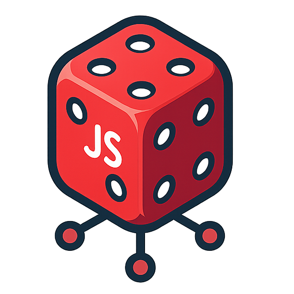

# DiceDB Node.js Driver

    
     
    
    

DiceDB Node.js Driver is a lightweight, promise-based database driver for DiceDB with built-in connection pooling. Designed for performance and simplicity, it lets you interact with DiceDB using a clean, modern API.

## Command Parity

DiceJS supports a wide range of DiceDB commands. Below is the list of currently supported commands:

| **Command**  | **Supported** |
| ------------ | ------------- |
| `DECR`       | ✅            |
| `DECRBY`     | ✅            |
| `DEL`        | ✅            |
| `ECHO`       | ✅            |
| `EXISTS`     | ✅            |
| `EXPIRE`     | ✅            |
| `EXPIREAT`   | ✅            |
| `EXPIRETIME` | ✅            |
| `FLUSHDB`    | ✅            |
| `GET`        | ✅            |
| `GETDEL`     | ✅            |
| `GETEX`      | ✅            |
| `GET.WATCH`  | ✅            |
| `HANDSHAKE`  | ✅            |
| `INCR`       | ✅            |
| `INCRBY`     | ✅            |
| `PING`       | ✅            |
| `SET`        | ✅            |
| `TTL`        | ✅            |
| `TYPE`       | ✅            |
| `UNWATCH`    | ✅            |

## Documentation

You can find the documentation [here](https://github.com/Aditya-ds-1806/dicedb-js/blob/main/docs/README.md) or on the website.

## License

This project is licensed under the MIT License. See the [LICENSE](./LICENSE) file for details.
